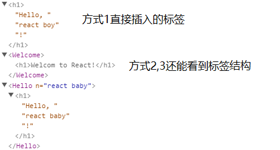

# 组件

组件用于将UI分为一个个独立、可复用的小部件。

## 定义组件

无论使用函数还是类定义，组件名称都需要首字母大写(约定)。  

1. 使用函数定义
    ```jsx
    function Hello(props: { n: string }) {
        return <h1>Hello, {props.n}!</h1>
    }
    ```
1. 使用类定义
    ```jsx
    class Welcome extends React.Component {
        render() {
            return <h1>Welcom to React!</h1>
        }
    }
    ```

## 渲染组件

```jsx
ReactDOM.render(Hello({ n: "react boy" }), document.getElementById("hello"))    //方式1
ReactDOM.render(<Welcome />, document.getElementById("welcome"))                //方式2
ReactDOM.render(<Hello n="react baby"/>, document.getElementById("baby"))       //方式3
```

在chrome安装react developer tools插件后，按F12在react标签页看到的页面结构：



## 组件属性和状态

组件属性是组件创建时通过构造函数的参数传入的值，在组件创建后，值不能再变化（约定）。  
状态是由组件完全控制的，值可以改变。

```jsx
/组件的泛型指明了props、state的类型结构
class Clock extends React.Component<{ name: string }, { date: Date }> {
    constructor(props: { name: string }) {
        super(props)                        //属性传递上去
        this.state = { date: new Date }     //状态一定要新建一个对象来保存
    }

    render() {
        return (
            <div>
                <h1>Clock:{this.props.name}</h1>    //使用属性值
                <h2>It is {this.state.date.toLocaleTimeString()}.</h2>  //使用状态值
            </div>
        )
    }
}
```

## 生命周期
