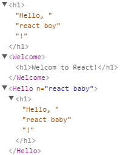

# 组件

组件用于将UI分为一个个独立、可复用的小部件。

## 定义组件

无论使用函数还是类定义，组件名称都需要首字母大写。  

1. 使用函数定义
    ```jsx
    function Hello(props: { n: string }) {
        return <h1>Hello, {props.n}!</h1>
    }
    ```
1. 使用类定义
    ```jsx
    class Welcome extends React.Component {
        render() {
            return <h1>Welcom to React!</h1>
        }
    }
    ```

## 渲染组件

```jsx
ReactDOM.render(<Welcome />, document.getElementById("welcome"))                //方式1
ReactDOM.render(<Hello n="react baby"/>, document.getElementById("baby"))       //方式2
ReactDOM.render(Hello({ n: "react boy" }), document.getElementById("hello"))    //方式3
```




## 组件属性

## 组件状态

## 生命周期

